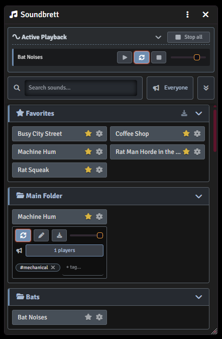

# Soundbrett

A GM soundboard for Foundry VTT — play folder-organized audio in sync to your
players, or just the ones you choose, with persistent per-sound settings,
search & tagging, and switchable themes.

<p align="center">
  
</p>

The Game Master opens a panel that lists every audio file from a configurable
folder (subfolders become categories). Sounds the GM starts are played back in
sync for connected players via sockets and can be controlled centrally
(pause/resume, stop, loop, volume).

## Features

- **Folder-based library** — point the module at a folder; subfolders show up as
  collapsible categories.
- **Synced playback** — sounds the GM triggers play for players too, kept in sync
  over sockets with a world-scope state so playback survives reloads and
  late-joining players catch up automatically.
- **Central controls** — pause/resume, stop, loop and per-track volume, plus a
  "stop all" button.
- **Per-sound settings (persistent)** — volume, loop, favorite, a custom display
  name and free-form tags are remembered per sound, independent of what is
  currently playing.
- **Favorites** — star a sound to collect it in a dedicated Favorites group.
- **Search** — filter by display name, original file name or tags; multi-term
  queries match any of the terms (OR).
- **Tagging** — add comma-separated tags per sound to find them across the folder
  structure.
- **Selective routing** — choose who hears a sound: everyone, only the GM, or
  specific players. Set a board-wide default and override it per sound.
- **Preloading** — warm up players' audio buffers ahead of time so larger sounds
  start instantly and in sync (single sound or all favorites at once).
- **Hotbar drag & drop** — drag a sound onto the macro bar to create a toggle
  macro for it.
- **Theming** — a restrained neutral default theme, an "arcane" look, and a
  Warhammer Fantasy Roleplay (WFRP) skin that is offered only while the
  `wfrp4e` system is active.

## Requirements

Foundry VTT **v14** or later.

## Installation

In Foundry VTT, go to **Add-on Modules → Install Module** and paste the manifest
URL:

```
https://github.com/xFeirefizx/soundbrett/releases/latest/download/module.json
```

Then enable **Soundbrett** in your world's module settings.

## Usage

1. As GM, open the **Playlists** sidebar — Soundbrett adds a button there that
   opens the soundboard window.
2. In the module settings, set **Soundbrett Folder Path** to the folder that holds
   your audio files (subfolders become categories).
3. Click a tile to play a sound; use the controls under "Active Playback" to
   pause, loop, stop or adjust volume. Players hear whatever their routing allows.

Only GMs can open and operate the soundboard; players react passively to the
GM's actions.

## Configuration

- **Soundbrett Folder Path** (world) — the folder scanned for audio files.
- **Theme** (world) — `neutral` (default), `arcane`, or `wfrp` (shown only when
  the wfrp4e system is active).

## Localization

English (the default language) and German are included. Contributions of further
languages are welcome.

## License

[MIT](LICENSE) © Feirefiz
